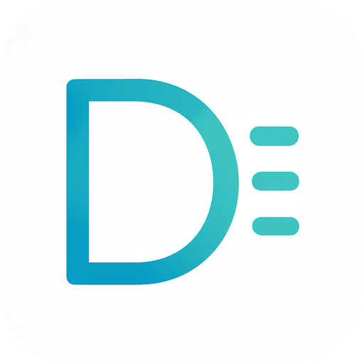

# DayCraft - 智能日报管理系统

<div align="center">
  
  <h3>高效记录工作，智能生成报告</h3>
  <p>基于 Next.js 14 和 Supabase 构建的现代化日报管理平台</p>
</div>

## 📋 项目概述

DayCraft 是一个专为职场人士设计的智能日报管理系统，帮助用户高效记录日常工作内容，并自动生成周报和月报。系统集成了 AI 辅助功能，可以润色和优化报告内容，让工作汇报更加专业高效。

### ✨ 主要特性

- **日报管理**：按项目分类记录工作内容，支持快速复制和编辑
- **自动周报月报**：基于日报内容自动生成周报和月报，节省汇总时间
- **项目管理**：创建和管理多个项目，对工作内容进行分类整理
- **AI 辅助润色**：使用 AI 技术优化报告内容，使表达更加专业清晰
- **数据可视化**：直观展示工作量和项目分布情况
- **响应式设计**：完美适配桌面和移动设备
- **安全可靠**：基于 Supabase 的行级安全策略，确保数据安全
- **现代化界面**：采用渐变背景、响应式布局和交互式元素的精美首页设计
- **PWA支持**：支持作为渐进式Web应用安装到桌面和移动设备

## 🚀 快速开始

### 前置条件

- Node.js 18.x 或更高版本
- npm 或 yarn 包管理器
- Supabase 账户

### 安装步骤

1. 克隆仓库

```bash
git clone https://github.com/yourusername/daycraft.git
cd daycraft
```

2. 安装依赖

```bash
npm install
# 或
yarn install
```

3. 配置环境变量

复制 `.env.example` 文件并重命名为 `.env`，然后填入你的 Supabase 配置信息：

```bash
cp .env.example .env
```

4. 初始化数据库

在 Supabase 控制台中运行 `sql/create_tables.sql` 文件中的 SQL 语句，创建所需的表结构。

5. 启动开发服务器

```bash
npm run dev
# 或
yarn dev
```

应用将在 [http://localhost:3000](http://localhost:3000) 启动。

## 🔧 技术架构

- **前端框架**: Next.js 14 (App Router)
- **UI 组件**: Tailwind CSS + Shadcn UI
- **状态管理**: React Context API
- **数据库**: Supabase PostgreSQL
- **认证系统**: Supabase Auth
- **PWA支持**: next-pwa
- **日期处理**: date-fns
- **通知组件**: Sonner
- **AI 集成**: OpenAI / Anthropic / DeepSeek API

## 📁 项目结构

```
/app                   # Next.js App Router目录
  /api                 # API 路由
  /(auth)              # 认证相关页面
  /dashboard           # 受保护的仪表盘页面
  /_offline            # 离线页面
/components            # 可复用组件
/contexts              # React Context
/lib                   # 工具库
  /supabase            # Supabase 客户端配置
  /utils               # 工具函数
  /validators          # 数据验证
/providers             # 全局 Provider 组件
/public                # 静态资源
  /icons               # PWA图标
  favicon.ico          # 网站图标
/sql                   # 数据库脚本
```

## ⚙️ 核心功能

### 首页设计

- 引人注目的英雄区域，清晰传达产品价值
- 功能特性展示，直观呈现产品核心优势
- 数据统计展示，增强产品可信度
- 用户评价轮播，提供社会证明
- 响应式设计，完美适配各种设备尺寸
- 交互式元素，提升用户体验

### 日报管理

- 按日期和项目记录工作内容
- 支持复制、编辑和删除日报
- 日报内容按项目分类展示
- 日报搜索和筛选功能

### 周报月报生成

- 基于日报内容自动生成周报和月报
- 支持预览、编辑和下载报告
- AI 辅助润色报告内容
- 按项目分类汇总工作内容

### 项目管理

- 创建、编辑和删除项目
- 项目状态管理（活跃/非活跃）
- 项目代码和描述维护

### AI 辅助功能

- 配置 AI 服务提供商和模型
- 自定义系统提示词和用户提示词
- 一键润色报告内容

## 📱 PWA 图标指南

为确保DayCraft应用在各种设备上显示正确的图标，我们已配置了以下图标文件：

### 已配置图标文件

在`public/icons`目录中包含以下图标文件：

1. **标准图标**
   - `icon-192x192.png` - 192x192像素，用于Android和其他平台
   - `icon-384x384.png` - 384x384像素，用于高分辨率设备
   - `icon-512x512.png` - 512x512像素，用于高分辨率设备和应用商店

2. **可遮罩图标**（支持自适应形状）
   - `maskable-icon-512x512.png` - 512x512像素，带有足够的安全区域
   
3. **苹果设备图标**
   - `apple-icon-180x180.png` - 180x180像素，用于iOS设备

4. **浏览器标签图标**
   - `favicon.ico` - 包含16x16、32x32和48x48像素的多尺寸图标